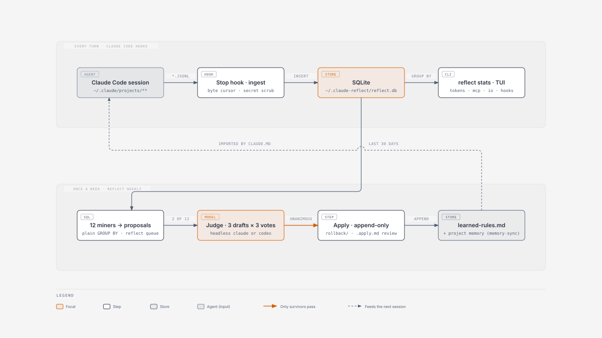

*English · [한국어](README.ko.md)*

# reflect

reflect reads what your coding agent **actually did** out of its own transcripts, loads it into
SQLite, and once a week turns those aggregates into concrete improvement proposals. Every claim it
makes is a `GROUP BY`, never a guess.

Built for [Claude Code](https://claude.com/claude-code). Runs on [bun](https://bun.sh) with zero
runtime dependencies (`bun:sqlite`, `Bun.spawn`). macOS, Linux and Windows.

## How it works



Two loops share one database.

**Every turn.** When a Claude Code turn ends, the Stop hook reads only the bytes appended to that
session's transcript since the last run, masks secrets, and inserts the rows into SQLite.
`reflect stats` and the TUI read the same tables; the hook itself computes nothing.

**Once a week.** `reflect weekly` runs twelve SQL miners over the last 30 days. Each miner that
finds something gets one proposal file in `~/.claude-reflect/proposals/`, written by a single model
call from the aggregated numbers. Ten of them are for you to read in `reflect queue`. Two produce
prose that could change the agent's prompt (`CLAUDE.md` drift, correction clusters), so they go
through the judge: three drafts, three refutation votes each, unanimous or nothing. What survives is
appended to `learned-rules.md` or a project memory file after a rollback copy is taken. Your
`~/.claude/CLAUDE.md` imports that file with `@`, so the next session starts with the rule in its
prompt — that is the arrow back.

## What it records

One source: `~/.claude/projects/**/*.jsonl`. Ingestion is incremental (a byte-offset watermark per
file) and idempotent (natural-key `INSERT OR IGNORE`), so re-running never duplicates a row.

| Table | One row is | Contents |
|---|---|---|
| `sessions` | a session | cwd, git branch, version, time span |
| `tool_calls` | a tool call | name, input JSON, error flag, skill/plugin/MCP attribution |
| `model_turns` | a model call | model, input, cache read/create, output, **thinking**, service tier |
| `hook_events` | a hook run | name, event, exit code, duration |
| `permission_events` | a denial | denial kind, target tool |
| `corrections` | a correction candidate | matched keyword, first 300 chars |
| `io_refs` (view) | a reference | file, URL, skill, MCP resource, memory file |

`io_refs` is a view over `tool_calls.input_json` plus `path_refs` (memory files named in Bash
commands), not a table — the same fact is never stored twice. `memory_snapshot`/`memory_changes`
record memory files created, modified or deleted between Stop hooks, since a write through a shell
variable leaves no path in the transcript.

⚠️ **Approvals cannot be counted.** An approved permission prompt leaves no trace in the
transcript. `permission_events` measures friction only: what was blocked, and by whom.

## Token optimization

```sh
reflect stats tokens                     # per model, all time
reflect stats tokens --since 2026-09-01  # windowed
reflect stats mcp                        # MCP servers and tools, with failure rates
reflect stats io                         # what gets referenced over and over
```

Two columns carry the diagnosis:

- **`avg_cache_read`** — resident context re-read on every turn: system prompt, `CLAUDE.md`,
  skills, tool definitions. When this is large, your **configuration** is the cost, not your
  conversation.
- **`thinking_pct`** — share of output tokens spent on reasoning. This is your `effortLevel`
  setting, made visible.

## The proposal loop

```sh
reflect collect   # incremental ingest
reflect verify    # coverage + no row loss
reflect propose   # mine -> draft -> judge -> apply
reflect queue     # proposals awaiting review
reflect weekly    # all of the above — the one command schedulers call
```

Twelve miners pull signal with plain SQL: hook friction, tools you rejected, failed hooks, unused
skills, high-error tools, repeated corrections, repeated tool sequences, `CLAUDE.md` drift, memory
hygiene, correction clusters, high-friction sessions, dormant workspaces.

Evidence comes from the last 30 days (`window_days`), and subagent calls are excluded so proposals
target main-loop behavior. Three miners ignore the window because age *is* their criterion: "never
used", file age, last activity.

Two of the twelve produce prose rather than numbers, so they go through an unattended judge: three
drafts from three angles (minimal fix, root cause, clarity), then three refutation votes per draft,
and only a **unanimous** draft survives. A two-vote bar was not reproducible — the same input flipped
between apply and reject week to week.

🔴 **Applying is append-only.** The model is never asked to re-emit a file: it cannot reproduce the
part it was not shown. It writes one new section; reflect concatenates. A response that does not
start with a heading is read as "nothing to add" and applied nowhere. Every target is backed up to
`~/.claude-reflect/rollback/` first.

## Settings and providers

```sh
reflect                          # settings screen (TUI) — every row opens a picker on Enter
reflect config                   # current values and where each came from
reflect config provider codex    # persist a choice
reflect config language ko       # language the model writes proposals in (default: en)
reflect providers                # installed? logged in?
reflect login                    # pick a provider, then run its login command
reflect login codex --api-key    # pipe $OPENAI_API_KEY in instead of a browser
reflect logout claude
```

Precedence is **environment variable > `~/.claude-reflect/config.json` > default**
(`REFLECT_PROVIDER`, `REFLECT_JUDGE_MODEL`, `REFLECT_WINDOW_DAYS`, `REFLECT_LANGUAGE`).

| Setting | Default | Meaning |
|---|---|---|
| `provider` | `claude` | which headless CLI runs judging and synthesis (`claude`, `codex`) |
| `judge_model` | `sonnet` on claude | model for drafts and votes — throwaway work, so not the default model |
| `window_days` | `30` | how many days of history proposals look at |
| `language` | `en` | language for generated proposals and rules |
| `auto_apply` | `false` | write judged proposals to `learned-rules.md`/memory without review |

With `auto_apply` off (the default) a judged proposal is saved next to its proposal file as
`<name>.apply.md` and stays in the queue; apply it with `reflect apply <target> <that file>`. Turn it
on only if you accept a weekly, unattended change to a file that is part of your agent's prompt.

reflect stores no credentials of its own. It runs each CLI's own login command (`claude auth login`,
`codex login`) and the credentials stay in that CLI's store. Logging in needs browser approval, so it
must run in your terminal. API keys are never accepted as arguments (`ps` would show them);
`--api-key` reads the provider's environment variable and passes it on stdin.

## Install

```sh
bun install.ts            # any OS: place code, create the `reflect` entry point, register hooks
bun install.ts --check    # hook registration state
bun install.ts --remove   # unregister
```

Hook commands call `bun <cli.ts> <command>` directly — no bash, no jq — so they work on Windows and
survive thin-PATH contexts like cron. `settings.json` is backed up and replaced atomically;
re-running never registers a hook twice.

| Event | Command | Job |
|---|---|---|
| Stop | `_stop-hook` | ingest just this turn's transcript |
| SessionStart, Stop | `memory-sync` | project memory (`type: feedback`/`user`) → `learned-rules.md` |
| SessionStart | `friction-check` | recent friction and pending proposals |

Hooks always exit 0. Recording must never block a session.

Two steps left.

1. Import the rules file from your `~/.claude/CLAUDE.md` — without this line, judged rules never
   reach a session:
   ```
   @~/.claude-reflect/learned-rules.md
   ```
2. Schedule `reflect weekly`:
   ```
   # macOS/Linux — cron (the wrapper sets PATH and USER, which cron lacks)
   0 9 * * 1 $HOME/.claude/tools/reflect/reflect_weekly.sh >> $HOME/.claude/tools/reflect/weekly.log 2>&1
   # Windows — Task Scheduler, weekly
   bun C:\Users\<you>\.claude\tools\reflect\src\cli.ts weekly
   ```

A Claude Code skill (`~/.claude/skills/reflect/`) is installed too, so you can ask in words —
"where are my tokens going", "switch the provider to codex" — and the agent runs the right command.

## Your data stays here

- Everything lives in local SQLite (`~/.claude-reflect/reflect.db`). There is no upload path.
- The database does hold your tool inputs — shell commands, edited file contents — up to 4,000
  characters each. Treat it like a shell history file.
- Headless judging calls run with no tools, no MCP servers and no user settings or hooks
  (`--tools "" --strict-mcp-config --setting-sources ""`). Transcript-derived text goes into those
  prompts, so an injected instruction has nothing to act with. It also cuts the per-call context from
  about 86k tokens to 3k.
- Secrets are masked by regex before insert: API keys, tokens, JWTs, `Bearer`, `password=`.
- User messages are not stored — only the first 300 characters of an utterance that matched a
  correction keyword.
- Only judging and synthesis call a model, with aggregated numbers and the proposal text.

## Limits

- `tool_calls.input_json` is capped at 4,000 characters; truncated rows drop out of `io_refs`.
- Paths inside Bash command strings are not extracted, except memory files
  (`~/.claude/projects/*/memory/*.md`).
- The sequence miner counts repeats within a single session and skips pairs of core local tools
  (`Bash`, `Read`, `Write`, `Edit`…) — that is the rhythm of coding, not something to automate.
- Hook command strings are stored up to 200 characters; `hook_name` carries the identity.
- The TUI uses `stty` for raw mode because bun's `setRawMode` hangs under a pty (bun 1.3.14). On
  Windows, where there is no `stty`, it falls back to `setRawMode`, then to a numbered prompt.
- Tested on macOS. Linux and Windows paths are handled but not verified on hardware.

## Development

```sh
bun test              # behavioral checks, no model calls
bunx tsc --noEmit     # type check (devDependencies only)
```

## License

MIT
